# Proyectos FTP en Linux

Este repositorio agrupa **tres proyectos prácticos** relacionados con la configuración, uso y automatización de **servidores FTP en sistemas Linux**, abarcando desde un servidor FTP anónimo hasta un servidor FTP seguro y su despliegue automatizado con Vagrant y Ansible.

---

## Índice

1. FTP Anónimo  
2. FTP Seguro con vsftpd  
3. Servidor FTP con Vagrant y Ansible  
4. Herramientas Utilizadas  

---

## 1. FTP Anónimo

### Descripción
Configuración de un **servidor FTP anónimo** destinado a funcionar como **mirror de OpenSuse**, instalado sobre un sistema Debian con nombre de host `mirror.sistema.sol`.

### Características
- Acceso únicamente para **usuarios anónimos**
- Escucha solo en **IPv4**
- Sin acceso para usuarios locales
- Mensaje de bienvenida:
- Mensaje informativo al acceder:

- Usuarios anónimos sin permisos de escritura
- Máximo de **200 conexiones simultáneas**
- Límite de **50 KB/s por usuario**
- Timeout de inactividad de **30 segundos**

### Objetivo
Aprender la configuración básica de un servidor FTP público aplicando restricciones de seguridad y rendimiento.

### Práctica
Login desde la consola de forma anónima

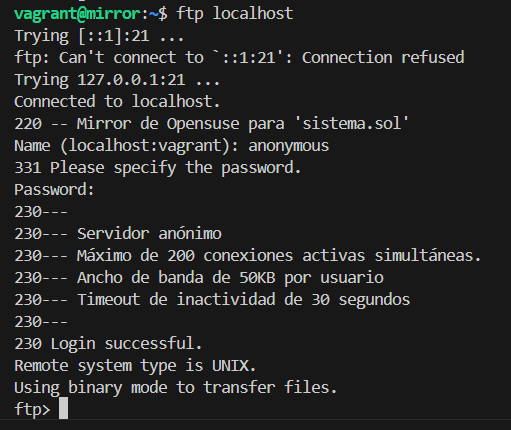

Prueba de conexion usando CrossFTP desde un sistema Windows

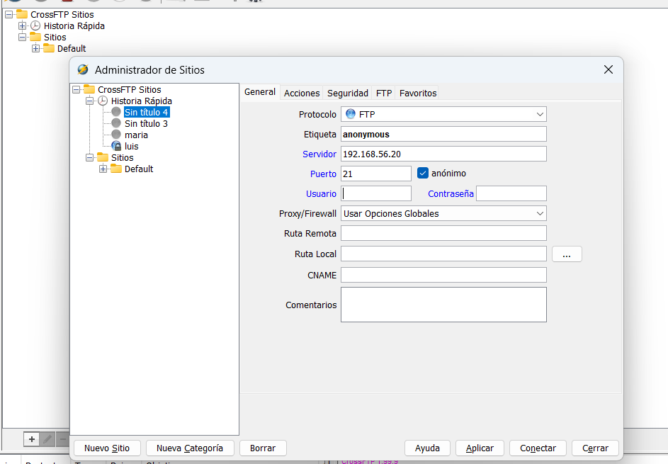

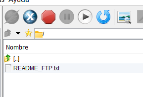

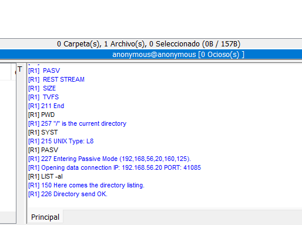

---

## 2. FTP Seguro con vsftpd

### Descripción
Instalación y configuración de un **servidor FTP seguro** utilizando `vsftpd`, permitiendo acceso anónimo y acceso autenticado con usuarios locales, incluyendo cifrado mediante **SSL/TLS (FTPS)**.

### Contenidos
- Uso del cliente FTP en **línea de comandos**
- Uso de clientes FTP **gráficos**
- Instalación y configuración del servidor `vsftpd`
- Gestión de usuarios locales
- Control de permisos y acceso
- Configuración avanzada:
- Mensajes de bienvenida
- Límite de conexiones simultáneas
- Control de ancho de banda
- Timeout de inactividad
- Usuarios enjaulados (chroot)
- Configuración de **FTP seguro (FTPS)** con certificados
- Pruebas de conexión:
- Anónima
- Autenticada
- Cifrada

### Objetivo
Comprender el funcionamiento del protocolo FTP y su configuración segura en entornos Linux.

### Práctica
Login con el usuario pepe (usuario no válido)
Login con usuario anónimo (accede)
Login con usuario válido María (accede)

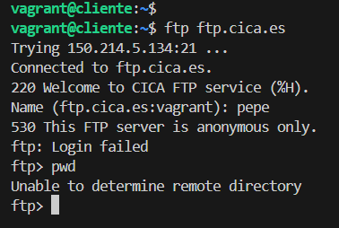
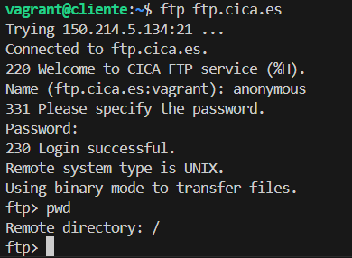
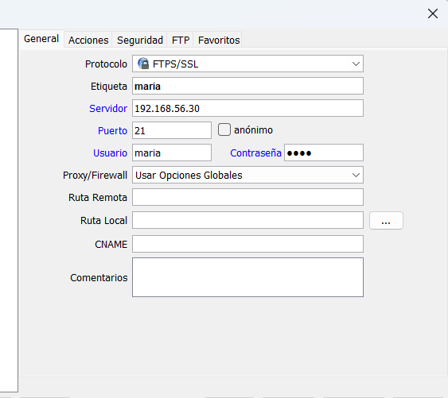
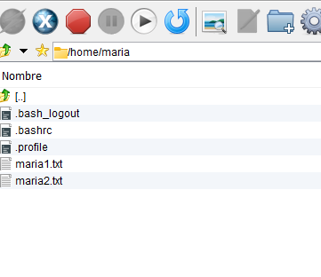

---

## 3. Servidor FTP con Vagrant y Ansible

### Descripción
Proyecto colaborativo para desplegar un **servidor FTP automatizado**, utilizando **Vagrant** para la virtualización y **Ansible** para la automatización de la configuración, gestionado mediante GitHub.

### Funcionalidades
- Creación automática de la máquina virtual con Vagrant
- Configuración del servidor FTP con playbooks y roles de Ansible
- Instalación y configuración de `vsftpd`
- Gestión de usuarios y permisos
- Aplicación de políticas de seguridad
- Pruebas funcionales del servicio FTP
- Verificación del código con `ansible-lint`
- Documentación completa del proyecto
- Gestión del trabajo en equipo con **GitHub Projects**

### Tarea adicional
- Configuración opcional de un **servidor DNS** con Ansible para resolver el dominio del servidor FTP.

### Objetivo
Aplicar **infraestructura como código (IaC)**, automatizar servicios y trabajar de forma colaborativa siguiendo buenas prácticas.

### Práctica 

Login en la consola
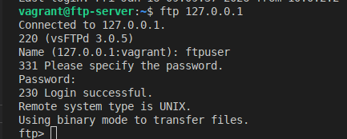

Login de usuario usando Filezilla
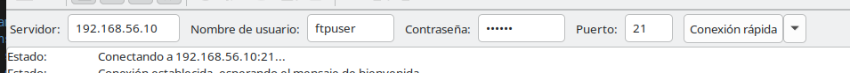

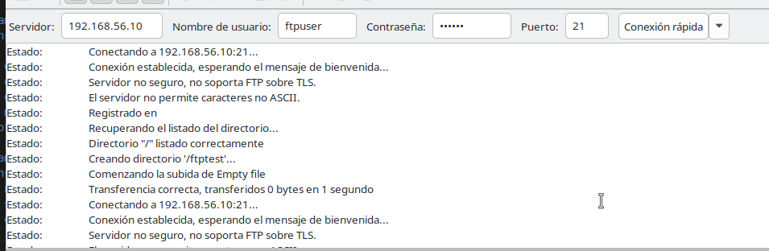

Creación de elementos en el servidor

---

## Herramientas Utilizadas

- Linux (Debian)
- vsftpd
- Cliente FTP (CLI y gráfico)
- Git y GitHub
- GitHub Projects
- Vagrant
- Ansible
- ansible-lint

